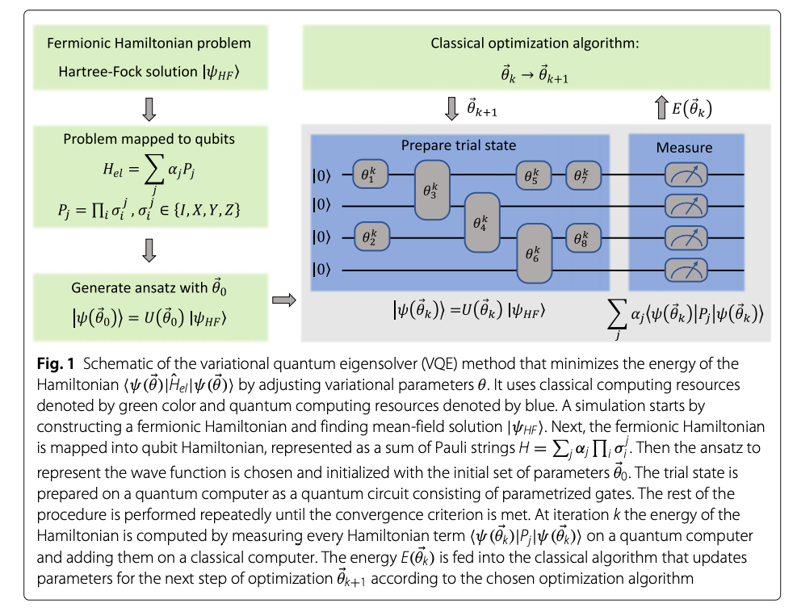

# Overview on Variational Quantum Eigensolver

> VQE is a method that uses a hybrid quantum-classical computational approach to find eigenvalues of a Hamiltonian. VQE is an alternative to fully quantum algorithms such as Quantum Phase Estimation (QPE) because it requires fewer quantum resources and is more suitable for near-term quantum devices.

The algorithm starts with a reasonable assumption about the form of the target wave function. The most common choice is to represent the wave function in a basis of atom-centered Gaussian basis functions. A trial wavefunction is constructed with adjustable parameters, followed by the design of a quantum circuit that prepares the ansatz on a quantum computer. The parameters are variationally adjusted until the expectation value of the electronic Hamiltonian is minimized

$$E \leq \frac{\langle \psi(\theta) | \hat{H}_{el} | \psi(\theta) \rangle}{\langle \psi(\theta) | \psi(\theta) \rangle}$$

where $\theta$ are the parameters of the quantum circuit ansatz. The electronic Hamiltonian $\hat{H}_{el}$ is written in the second quantization formalizem 

$$H_{el} = \sum_{p,q} h_{pq} a_p^\dagger a_q + \frac{1}{2} \sum_{p,q,r,s} h_{pqrs} a_p^\dagger a_q^\dagger a_r a_s$$

where $a_p^\dagger$ and $a_q$ are fermionic creation and annihilation operators which excite electrons from orbital $p$. The first term in this Hamiltonian corresponds to single-electron excitations, and the second term corresponds to two-electron excitationss. $h_{pq}$ and $h_{pqrs}$ are one- and two-electron integrals that can be computed classically.

The Hamiltonian for indistinguishable fermions has to be mapped onto the Hamiltonian of distinguishable qubits by using one of the common mappings:

+ Jordan-Wigner
+ Bravyi-Kitaev
+ Parity

After the mapping the qubit Hamiltonian is of the form:

$$\hat{H} = \sum_j \alpha_j P_j = \sum_{j} \alpha_j \prod_{i}\sigma_i^j$$ 

where $\alpha_j$ are real scalar coefficients that depend on $h_{pq}$ and $h_{pqrs}$ and $P_j$ are Pauli-strings represented by a product of Pauli operators $\sigma_i^j \in \{I, X, Y, Z\}$ acting on qubit $i$. 

After the qubit Hamiltonian is prepared on a classical computer and the ansatz to represent the wave function is chosen the trial wave function $|\psi(\theta)\rangle$ is prepared on the quantum computer. The quantum computer is used to measure the energy:

$E(\theta) = \sum_j^N \alpha \langle \psi(\theta) | \prod_i \sigma_i^j | \psi(\theta) \rangle$

Here $N$ is the number of terms in the Hamiltonian and $\theta$ is the vector of the variational parameters. Depending on the chosen basis set and mapping type, the Hamiltonian can contain up to $M^4$ terms where $M$ is the number of basis functions. Since these terms represented by the Pauli string operators are non-cummutative the state preparation has to be performed repeatedly for each term that is measured separately. In addition, all the individual terms have to be measured multiple times to obtain a good estimate of the expectation value.

# Optimization Problem

We consider the optimzation problem where the total energy of the molecule is minimized with respect to the positions of the nuclei. We can treet nuclei as point particles and consider the minimization function as $E(x)$ where $x$ is the vector of the positions of the nuclei in 3D space.

We want to determine $\nabla_x E(x) = 0$ as a stationary point of this optimization problem.

## Overview of the Quantum Algorithm

In order to find this equilibrium position we use the variational quantum algorithm. Idea is to consider the target electronic Hamiltonian $H(x)$ which is a parametrized observable that depends on the nuclear cooridnates. 

+ The objective function is defined as the expectation value of the Hamiltonian
+ The trial state is prepared by a quantum computer, depends on both the quantum circuit and the Hamiltonian parameters.

$$g(\theta, x) = \langle \Psi(\theta) | H(x) | \Psi(\theta)\rangle$$ 

is the expectation function with respect to the circuit parameters $\theta$ and the nuclear coordinates $x$.

We consider the following steps:

+ Build a parametrized electronic Hamiltonian $H(x)$ for the molecule 
+ Design the variational quantum circuit to prepare the electronic trial state of the molecule $|\Psi(\theta)\rangle$
+ Initialize the variational parameters $\theta$ and $x$ and perform a joint optimization of the circuit and the Hamiltonian parameters to minimize the objective function $g(\theta, x)$

## Electronic Structure Calculations and Mappings

Molecular Hamiltonian is given by:

$$\mathcal{H} = - \sum_I \frac{\nabla_{R_i}^2}{M_I} - \sum_i \frac{\nabla_{r_i}^2}{m_e} - \sum_{i,I} \frac{Z_I}{|r_i - R_I|} + \frac{1}{2} \sum_{i \neq j} \frac{1}{|r_i - r_j|} + \frac{1}{2} \sum_{I \neq J} \frac{Z_I Z_J}{|R_I - R_J|}$$

where $R_I$ are the positions of the nuclei and $r_i$ are the positions of the electrons. After BO-Approximation we can consider the electronic problem with nuclear coordinates entering only as parameters:

$$\mathcal{H}_{el} |\Psi_n\rangle = E_n(R) |\Psi_n\rangle$$

with

$$\mathcal{H}_{el} = - \sum_i \frac{\nabla_{r_i}^2}{m_e} - \sum_{i,I} \frac{Z_I}{|r_i - R_I|} + \frac{1}{2} \sum_{i \neq j} \frac{1}{|r_i - r_j|}$$

The ground state energy here is given by

$$E_0 = \frac{\langle \Psi_0 | \mathcal{H}_{el} | \Psi_0 \rangle}{\langle \Psi_0 | \Psi_0 \rangle}$$

### HF Method

The HF method approximates a $N$-body problem into $N$ one-body problem where each electron evolves in the mean-field of the others. Clasically solving the HF equations is efficient and leads to the exact exchange energy but does not include any electron correlation.

The Hamiltonian can be re-expressed in the basis of the solutions of the HF method in so called moleculas orbitals

$$\hat{H}_el = \sum_{pq} h_{pq} a_p^\dagger a_q + \frac{1}{2} \sum_{pqrs} h_{pqrs} a_p^\dagger a_q^\dagger a_r a_s$$

With 1-body integrals

$h_{pq} = \int \psi^*_p(r) \left( -\frac{\nabla_r^2}{2} - \sum_I \frac{Z_I}{|r - R_I|} \right) \psi_q(r) dr$

And 2-body integrals

$h_{pqrs} = \int \int \psi^*_p(r_1) \psi^*_q(r_2) \frac{1}{|r_1 - r_2|} \psi_r(r_2) \psi_s(r_1) dr_1 dr_2$

The MO's $\psi_p$ can be occupied or virtual. One MO can contain 2 electrons. We work with spin-orbitals which are associated with a spin up ($\alpha$) or spin down ($\beta$) state.

### Fermionic Mappers

The fermionic mappers transform fermionic operators into the qubit space. In `qiskit-nature` the following mappers are implemented:

+ Jordan Wigner 
+ Parity 
+ Bravyi-Kitaev

#### Jordan-Wigner Mapping

Again the electric Hamiltonian in the second quantized formalism is given by:

$$\hat{H}_{el} = \sum_{i,j} h_{ij} a_i^\dagger a_j + \frac{1}{2} \sum_{i,j,k,l} h_{ijkl} a_i^\dagger a_j^\dagger a_k a_l$$

Although the number of $h_{ij}$ and $h_{ijkl}$ terms scales quartically with the number of orbitals they are efficiently computable classically.

Traditionally the simplest encoding scheme is the Jordan-Wigner transformation. Here $n$ qubits are used to store the occupation number of $n$ spin-orbitals, forming what is called a occupation basis. If the i-th molecular orbital is occupied then the corresponding ith qubit is in the $|1 \rangle$ state otherwise in the $|0 \rangle$ state. The fermionic creation and annihilation operators are mapped to qubit operators as follows:

$$\hat{Q}^+ |0\rangle = |1\rangle$$
$$\hat{Q}^+ |1\rangle = |0\rangle$$
$$\hat{Q}^-|0\rangle = 0$$
$$\hat{Q}^-|1\rangle = |0\rangle$$

Problem is that the standard Pauli $\sigma_i^+$ and $\sigma_i^-$ operators do not satisfy the anti-commutation relations of the fermionic operators:

$$\{ a_i^\dagger, a_j \} = \delta_{ij}$$
$$\{ a_i^\dagger, a_j^\dagger \} = 0$$
$$\{ a_i, a_j \} = 0$$

For these to hold the parity of the occupation numbers of the orbitals with index less than $i$ must be calculated and a phase shift is introduced when the parity is odd. This is accomplished by performing a sequency of Pauli-Z operations on the preceding qubits. The mapping is given by:

$$a_i^\dagger = \frac{1}{2} (X_i - iY_i) \otimes Z_{i-1} \otimes Z_{i-2} \otimes ... \otimes Z_0$$
$$a_i = \frac{1}{2} (X_i + iY_i) \otimes Z_{i-1} \otimes Z_{i-2} \otimes ... \otimes Z_0$$

This mapping requies $O(n)$ Pauli operators to represent a single fermionic operator which can lead to long Pauli strings in the Hamiltonian.

#### Bravyi-Kitaev Mapping

For a molecular orbital basis of size $N$ there are again $N$ qubits used 

# Resources

+ https://link.springer.com/article/10.1186/s41313-021-00032-6
+ https://pubs.acs.org/doi/full/10.1021/acs.jctc.8b00450